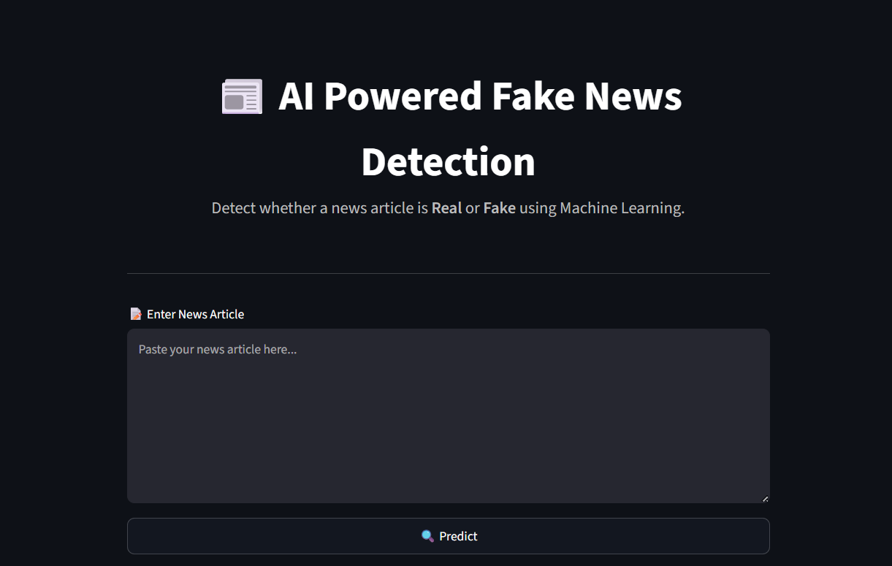
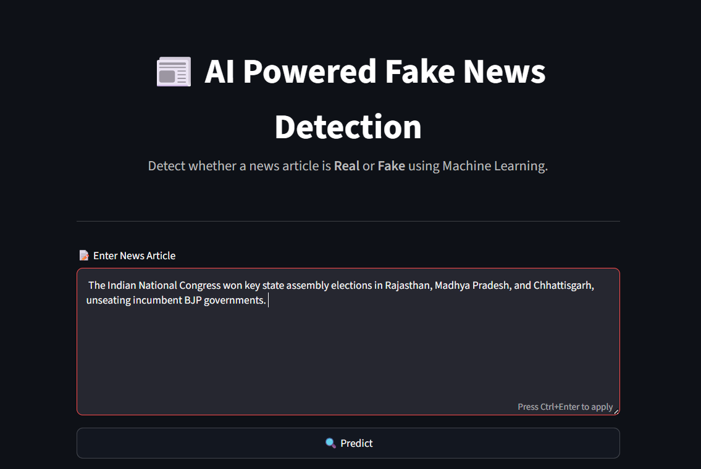
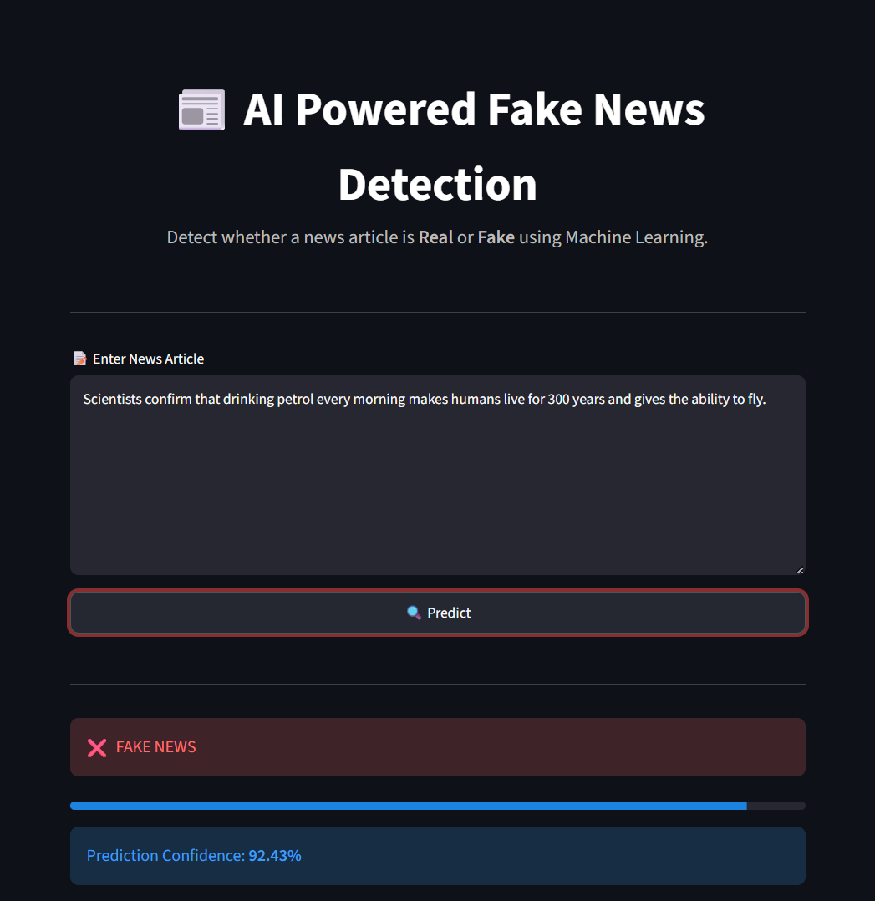
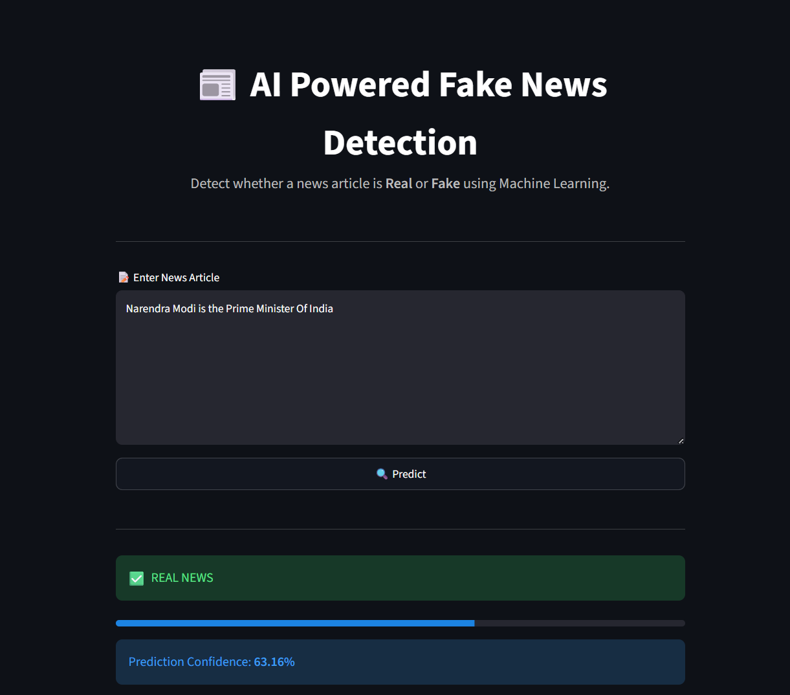

# 📰 AI Fake News Detection using Machine Learning

<div align="center">


An AI-powered Fake News Detection System built using Machine Learning and Streamlit.

</div>

---

# 📌 Project Overview

Fake news spreads rapidly across social media and news websites, making it difficult for people to distinguish between genuine and misleading information.

This project uses Machine Learning and Natural Language Processing (NLP) techniques to classify whether a news article is **Real** or **Fake**.

The application provides an easy-to-use Streamlit interface where users can paste any news article and instantly receive:

- ✅ Prediction
- 📊 Confidence Score
- ⚡ Fast Results

---

# 🎯 Demo

The application allows users to paste any news article and instantly predict whether it is **Real** or **Fake** using a trained Machine Learning model.

### The prediction includes:

- 📰 News Classification (Real / Fake)
- 📊 Confidence Score
- ⚡ Instant Analysis
- 🎨 Interactive Streamlit Interface

---

# ✨ Features

- Detects Fake and Real News
- Machine Learning based prediction
- Interactive Streamlit Web Application
- Prediction Confidence Score
- User Friendly Interface
- Fast Text Processing using TF-IDF
- Pre-trained Machine Learning Model

---

# 🧠 Machine Learning Workflow

```text
News Text
      │
      ▼
Text Cleaning
      │
      ▼
TF-IDF Vectorization
      │
      ▼
Machine Learning Model
      │
      ▼
Prediction
      │
      ▼
Real News ✅ / Fake News ❌
```

---

# 🛠 Technologies Used

- Python
- Streamlit
- Scikit-learn
- Pandas
- NumPy
- Pickle
- TF-IDF Vectorizer

---

# 📂 Project Structure

```text
AI-Fake-News-Detection/
│
├── app.py
├── AI_Fake_News_Detection.ipynb
├── fake_news_model.pkl
├── tfidf_vectorizer.pkl
├── Fake.csv
├── True.csv
├── requirements.txt
├── README.md
└── archive/
```

---

# 📊 Dataset

The project is trained using two datasets:

- 📄 Fake.csv
- 📄 True.csv

These datasets are used for training and evaluating the Machine Learning model.

---

# ⚙️ Installation

Clone the repository

```bash
git clone https://github.com/rohangone/AI-Fake-News-Detection.git
```

Move into the project

```bash
cd AI-Fake-News-Detection
```

Install the required dependencies

```bash
pip install -r requirements.txt
```

Run the Streamlit application

```bash
streamlit run app.py
```

---

# 🚀 How to Use

1. Launch the Streamlit application.
2. Paste a news article into the text area.
3. Click **Predict**.
4. View whether the news is **Real** or **Fake**.
5. Check the prediction confidence score.

---

# 📈 Future Improvements

- 🤖 Deep Learning Models (LSTM / BERT)
- 🌐 Live News API Integration
- 🌍 Multi-language News Detection
- 🔗 News URL Detection
- 🧠 Explainable AI Predictions
- 📱 Mobile Responsive UI

---

# 👨‍💻 Author

**Rohan Gone**

**B.Tech – Artificial Intelligence & Data Analytics**

MIT Art, Design and Technology University, Pune

### Repository

https://github.com/rohangone/AI-Fake-News-Detection

---

# 📄 License

This project is developed for educational, academic, and internship purposes.

---

# ⭐ Support

If you found this project helpful, consider giving it a ⭐ on GitHub!

---

# 📸 Project Screenshots

## 🏠 Home Page



---

## 📝 Input News Article



---

## ❌ Fake News Prediction



---

## ✅ Real News Prediction

